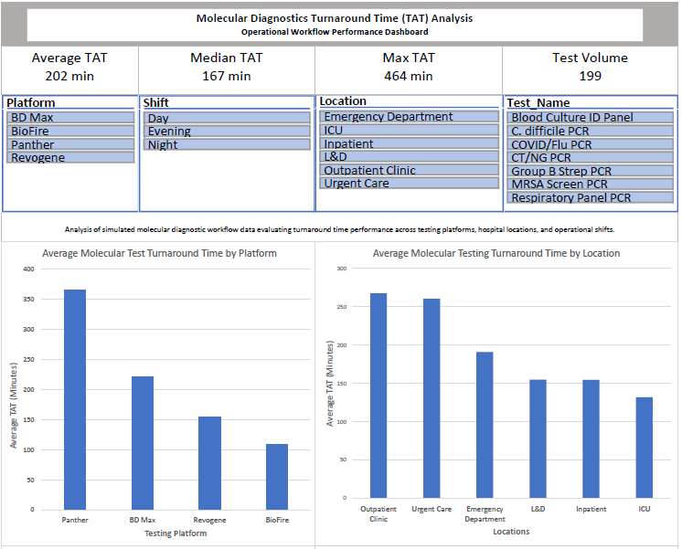

# Molecular Diagnostics Turnaround Time (TAT) Dashboard
Excel Dashboard | Healthcare Analytics | Clinical Laboratory Data

This project analyzes simulated molecular diagnostic laboratory workflow data to evaluate **turnaround time (TAT) performance** across testing platforms, hospital locations, and operational shifts.

The dashboard was built in Excel to simulate the type of operational reporting used in clinical laboratories and healthcare analytics environments.

---

## Dashboard Preview



## Project Structure

```
molecular-tat-dashboard/
│
├── Molecular_TAT_Dashboard.xlsx   # Interactive Excel dashboard
├── dashboard_preview.png          # Dashboard screenshot for README
└── README.md                      # Project documentation
```

## Key Metrics

| Metric | Value |
|------|------|
| Average TAT | 202 minutes |
| Median TAT | 167 minutes |
| Maximum TAT | 464 minutes |
| Total Test Volume | 199 |

---

## Dashboard Features

- Interactive filtering using slicers
- Turnaround time analysis by testing platform
- Turnaround time comparison by hospital location
- Turnaround time analysis by operational shift
- Workflow stage breakdown (Order → Collect → Receive → Result)

---

## Tools Used

- Microsoft Excel
- Pivot Tables
- Pivot Charts
- Dashboard Design
- Healthcare Operational Metrics

---

## Analytical Approach

The project workflow included:

1. Structuring a simulated laboratory dataset
2. Calculating Total Turnaround Time (TAT)
3. Building pivot tables to summarize operational metrics
4. Creating charts to visualize performance trends
5. Designing an interactive dashboard using slicers and KPI metrics

---

## Real-World Application

Turnaround time analysis is an important operational metric in **clinical laboratories and healthcare operations**. Dashboards like this help laboratory leadership:

- Monitor laboratory performance
- Identify workflow delays
- Evaluate testing platform efficiency
- Track operational trends

This type of reporting is commonly used in **laboratory informatics, LIS systems, and healthcare analytics environments**.

---

## Future Enhancements

Possible future improvements include:

- SQL-based laboratory workflow analysis
- Python statistical analysis of TAT data
- Power BI or Tableau dashboard development
- HL7 message workflow analysis

---

## Author

Stephen Henderson  
Medical Laboratory Scientist (MLS)  
Interested in Healthcare Informatics, LIS Systems, and Clinical Data Analytics
