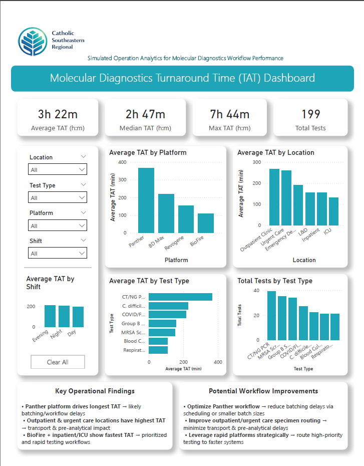
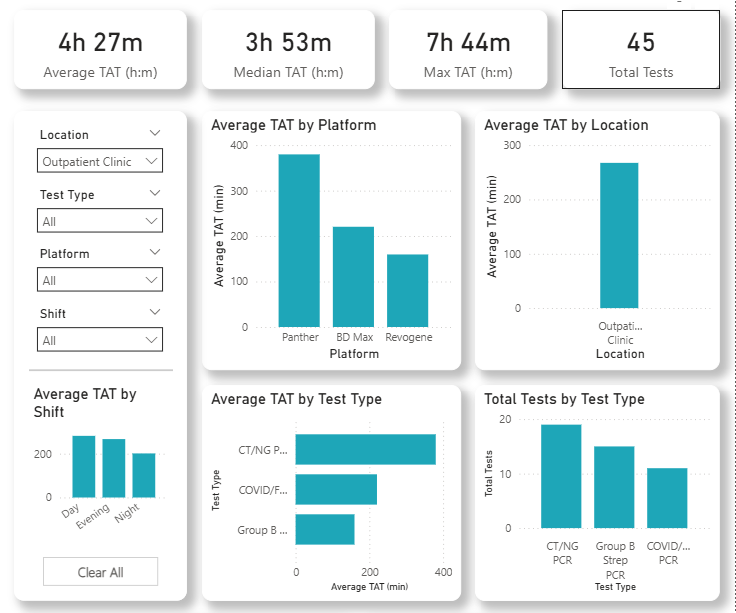
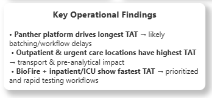
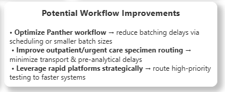

# Molecular Diagnostics Turnaround Time (TAT) Dashboard  
**Excel → Power BI Enhancement | Healthcare Analytics | Clinical Laboratory Data**

This project analyzes simulated molecular diagnostic laboratory workflow data to evaluate **turnaround time (TAT) performance** across testing platforms, hospital locations, and operational workflows.

Originally developed as an Excel dashboard, this project has been **rebuilt in Power BI** to improve interactivity, visualization, and analytical depth.

---

## 🔄 Project Evolution

### Version 1 – Excel Dashboard
- Pivot tables and charts  
- Static KPI tracking  
- Slicer-based filtering  

### Version 2 – Power BI Dashboard (Current)
- Fully interactive dashboard with dynamic filtering  
- KPI calculations using DAX (formatted in hours and minutes)  
- Improved layout and visual design  
- Integrated operational insights and workflow recommendations  

---

## 📊 Dashboard Preview

### Power BI Dashboard

---

### 🔄 Interactive Filtering Example

---

### 🔍 Key Operational Insights

---

### ⚙️ Workflow Improvement Recommendations

---

## 📁 Project Structure

---

molecular-tat-dashboard/
│
├── excel-version/
│ └── Molecular_TAT_Dashboard.xlsx
│
├── powerbi-version/
│ └── Molecular_TAT_Dashboard.pbix
│
├── images/
│ ├── powerbi_dashboard_full.png
│ ├── powerbi_dashboard_filtered.png
│ ├── powerbi_findings.png
│ └── powerbi_recommendations.png
│
└── README.md

---

## 📈 Key Metrics (Power BI Version)

| Metric | Value |
|------|------|
| Average TAT | 3h 22m |
| Median TAT | 2h 47m |
| Maximum TAT | 7h 44m |
| Total Tests | 199 |

---

## 📊 Dashboard Features

- KPI tracking (Average, Median, Max TAT, Total Tests)  
- Turnaround time analysis by platform, location, and test type  
- Test volume distribution  
- Interactive filtering (location, platform, test type, shift)  
- Operational findings and workflow improvement recommendations  

---

## 🛠️ Tools Used

- **Power BI** (dashboard development, data modeling)  
- **DAX** (custom KPI calculations and formatting)  
- **Microsoft Excel** (initial dashboard and data preparation)  

---

## 🧠 Analytical Approach

The project workflow included:

1. Structuring a simulated laboratory dataset  
2. Calculating Total Turnaround Time (TAT)  
3. Building initial Excel-based dashboard  
4. Rebuilding the project in Power BI for enhanced interactivity  
5. Implementing DAX measures for KPI calculations and formatting  
6. Designing an interactive dashboard for operational insight  

---

## 🏥 Real-World Application

Turnaround time analysis is an important operational metric in **clinical laboratories and healthcare operations**.

Dashboards like this help laboratory leadership:

- Monitor laboratory performance  
- Identify workflow delays  
- Evaluate testing platform efficiency  
- Track operational trends  

This type of reporting is commonly used in:
- **Laboratory Informatics**  
- **LIS Systems**  
- **Healthcare Analytics Environments**  

---

## 🔮 Future Enhancements

Possible future improvements include:

- SQL-based laboratory workflow analysis  
- Python-based statistical analysis of TAT data  
- Predictive modeling for turnaround time optimization  
- HL7 message workflow analysis  

---

## ⚠️ Disclaimer

This project uses simulated data and a fictional healthcare organization for demonstration purposes only.

---

## 👤 Author

**Stephen Henderson**  
Medical Laboratory Scientist (MLS)  
Interested in Healthcare Informatics, LIS Systems, and Clinical Data Analytics  
